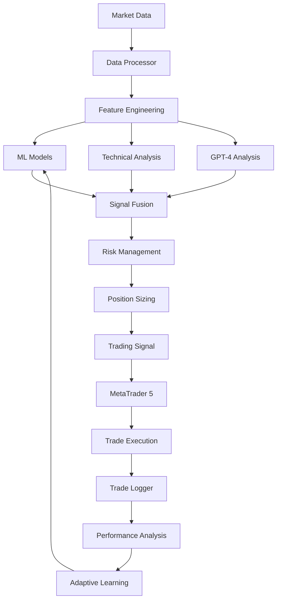

# System Overview - AI Gold Scalper

## 📋 What is the AI Gold Scalper?

The AI Gold Scalper is a sophisticated algorithmic trading system specifically designed for XAUUSD (Gold) trading. It combines multiple artificial intelligence techniques, advanced technical analysis, and risk management to generate profitable trading signals with minimal human intervention.

## 🎯 Core Philosophy

### Intelligence First
- **Multi-layered AI**: Combines machine learning, ensemble models, and GPT-4 analysis
- **Adaptive Learning**: Continuously improves based on trading results
- **Market Regime Awareness**: Adapts strategy based on market conditions

### Professional Trading
- **Risk Management**: Built-in position sizing and risk controls
- **Performance Monitoring**: Real-time analytics and reporting
- **Production Ready**: Designed for 24/7 operation

### Flexibility & Control
- **Modular Architecture**: Enable/disable components as needed
- **Multiple Deployment Options**: Local development to VPS production
- **Extensive Configuration**: Customize every aspect of the system

## 🏗️ High-Level Architecture

```
┌─────────────────────────────────────────────────────────────────┐
│                    AI GOLD SCALPER SYSTEM                      │
├─────────────────────────────────────────────────────────────────┤
│  🎛️  SYSTEM ORCHESTRATOR (Management & Monitoring)            │
├─────────────────────────────────────────────────────────────────┤
│  🧠 AI INTELLIGENCE LAYER                                      │
│     ├── Machine Learning Models (Random Forest, XGBoost, etc.) │
│     ├── Ensemble Models (Voting, Stacking, Bagging)           │
│     ├── GPT-4 Analysis (Market sentiment & reasoning)         │
│     └── Market Regime Detection (Volatility, trend analysis)  │
├─────────────────────────────────────────────────────────────────┤
│  📊 ANALYTICS & MONITORING                                     │
│     ├── Performance Dashboard (Real-time monitoring)          │
│     ├── Trade Logger (Comprehensive trade tracking)           │
│     ├── Risk Manager (Position sizing & risk controls)        │
│     └── Backtesting System (Historical validation)            │
├─────────────────────────────────────────────────────────────────┤
│  🔄 DATA & INTEGRATION                                         │
│     ├── Market Data Processor (Price data ingestion)          │
│     ├── Model Registry (ML model management)                  │
│     ├── Configuration System (Settings management)            │
│     └── API Layer (External system integration)               │
├─────────────────────────────────────────────────────────────────┤
│  🎯 TRADING EXECUTION                                          │
│     └── MetaTrader 5 Integration (Live trading platform)      │
└─────────────────────────────────────────────────────────────────┘
```

## 🧠 AI Intelligence Components

### 1. Machine Learning Models
- **Random Forest**: Ensemble decision trees for robust predictions
- **Gradient Boosting**: Sequential learning for improved accuracy
- **Neural Networks**: Deep learning for complex pattern recognition
- **Support Vector Machines**: High-dimensional pattern classification

### 2. Ensemble Intelligence
- **Voting Classifiers**: Multiple models vote on trading decisions
- **Stacking Models**: Meta-learning combines base model predictions
- **Bagging Systems**: Bootstrap aggregating for variance reduction

### 3. Market Regime Detection
- **Volatility Analysis**: Identifies high/low volatility periods
- **Trend Classification**: Determines trending vs ranging markets
- **Volume Pattern Recognition**: Analyzes trading volume patterns
- **Microstructure Analysis**: Studies market efficiency and liquidity

### 4. GPT-4 Integration
- **Market Sentiment Analysis**: Interprets market conditions
- **Signal Reasoning**: Provides human-readable trade rationale
- **Risk Assessment**: Evaluates potential trade outcomes

## 📊 Core System Components

### System Orchestrator
**Purpose**: Central command and control
- Manages all system components
- Monitors component health
- Handles startup/shutdown sequences
- Provides system status reporting

### AI Server
**Purpose**: Core trading signal generation
- Consolidates ML predictions
- Applies technical analysis
- Integrates GPT-4 insights
- Generates final trading signals

### Model Registry
**Purpose**: Machine learning model management
- Stores trained models with metadata
- Tracks model performance over time
- Enables model versioning and rollback
- Automates model selection based on performance

### Performance Dashboard
**Purpose**: Real-time system monitoring
- Displays trading performance metrics
- Shows system health indicators
- Provides component status overview
- Enables performance analysis

## 🔄 Data Flow Overview


- A.) **MT5 (Market Data)** → B.) **Market Data Processor** ↓
    - → C.) **Feature Engineering** → D.) **ML Models** ↓ 
    - → C.) **Feature Engineering** → E.) **Technical Analysis** ↓
    - → C.) **Feature Engineering** → F.) **Market Data Processor** ↓
- G.) **Signal Fusion** ↓
- H.) **Risk Management** ↓
- I.) **Position Sizing** ↓
- J.) **Trading Signal** ↓
- K.) **MT5 EA** ↓
- L.) **Trade Execution** ↓
- M.) **Trade Logger** ↓
- N.) **Performance Analysis** ↓
- O.) **Adaptive Learning** → D.) **ML Models** → G.) **Signal Fusion**

## 🎯 Key Features

### Intelligence Features
- **Multi-Algorithm Ensemble**: Combines 6+ ML algorithms
- **Adaptive Learning**: Improves performance over time
- **Market Regime Awareness**: Adapts to changing market conditions
- **GPT-4 Reasoning**: Provides human-like market analysis

### Trading Features
- **Real-time Signal Generation**: Sub-second signal processing
- **Risk Management**: Position sizing and drawdown protection
- **Multi-timeframe Analysis**: Analyzes multiple time horizons
- **Backtesting Integration**: Historical performance validation

### Operational Features
- **24/7 Operation**: Designed for continuous trading
- **Component Health Monitoring**: Automatic failure detection
- **Performance Analytics**: Comprehensive performance tracking
- **Flexible Deployment**: Local, VPS, or cloud deployment

## 🚀 Deployment Options

### Local Development
- **Purpose**: Research, development, and testing
- **Resources**: Uses local CPU/GPU for ML training
- **Components**: Full suite including research tools
- **Best For**: Strategy development and optimization

### VPS Production
- **Purpose**: Live trading in production environment
- **Resources**: Optimized for minimal resource usage
- **Components**: Core trading components only
- **Best For**: Stable 24/7 trading operation

### Hybrid Setup
- **Purpose**: Best of both worlds
- **Architecture**: VPS for trading, local for development
- **Sync**: Models trained locally, deployed to VPS
- **Best For**: Professional trading operations

## 📈 Performance Characteristics

### Typical Performance Metrics
- **Win Rate**: 65-75% (varies by market conditions)
- **Risk-Reward Ratio**: 1:1.5 to 1:2
- **Maximum Drawdown**: <5% (with proper risk management)
- **Sharpe Ratio**: 1.5-2.5 (depending on configuration)

### System Performance
- **Signal Generation**: <100ms average response time
- **Memory Usage**: 200MB-2GB (depending on components)
- **CPU Usage**: 5-20% on modern systems
- **Network Requirements**: Minimal (market data only)

## 🔧 Customization Levels

### Beginner Level
- **Use**: Default configurations
- **Modify**: Basic risk parameters only
- **Focus**: Learning and observation

### Intermediate Level
- **Use**: Component selection and basic tuning
- **Modify**: Signal weights and timeframes
- **Focus**: Performance optimization

### Advanced Level
- **Use**: Custom model training and ensemble configuration
- **Modify**: Feature engineering and algorithm parameters
- **Focus**: Research and strategy development

### Expert Level
- **Use**: Custom component development
- **Modify**: Core algorithms and system architecture
- **Focus**: System extension and innovation

## 🎯 Success Factors

### Technical Success
- **Proper Configuration**: Correct signal weights and risk parameters
- **Adequate Resources**: Sufficient CPU/RAM for chosen components
- **Stable Infrastructure**: Reliable internet and VPS hosting
- **Regular Monitoring**: Active system health monitoring

### Trading Success
- **Risk Management**: Never risk more than you can afford to lose
- **Realistic Expectations**: Understand that losses are part of trading
- **Continuous Learning**: Monitor performance and adjust accordingly
- **Patience**: Allow the system time to demonstrate its capabilities

## 🔄 Next Steps

Now that you understand the system overview:

1. **[Installation Guide](03_Installation_Guide.md)** - Set up your environment
2. **[System Architecture](04_System_Architecture.md)** - Deep dive into architecture
3. **[Component Reference](05_Component_Reference.md)** - Understand each component
4. **[Configuration Guide](21_Configuration_Guide.md)** - Customize your setup

---

*The AI Gold Scalper represents the convergence of advanced AI, professional trading practices, and robust software engineering - designed for serious algorithmic traders.*
